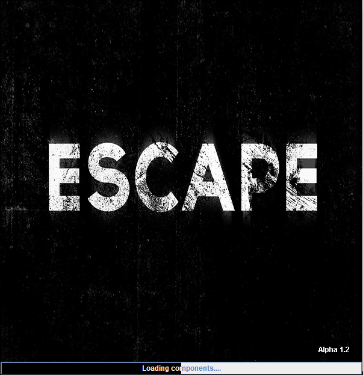
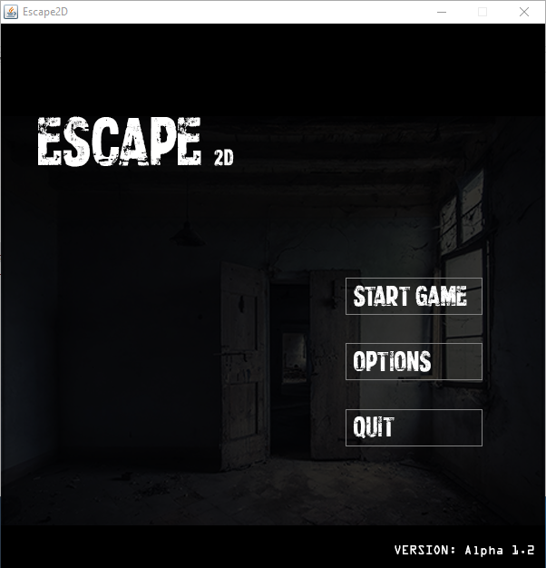
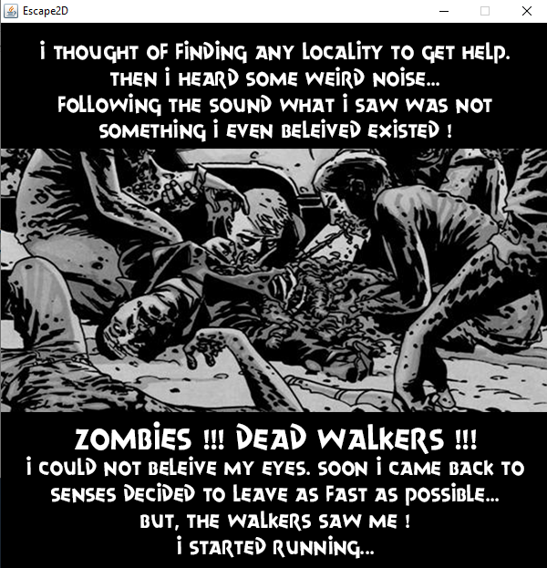
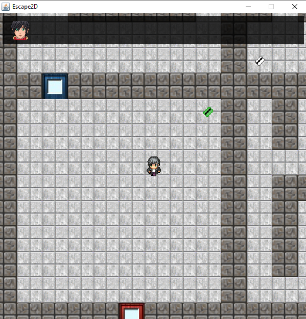
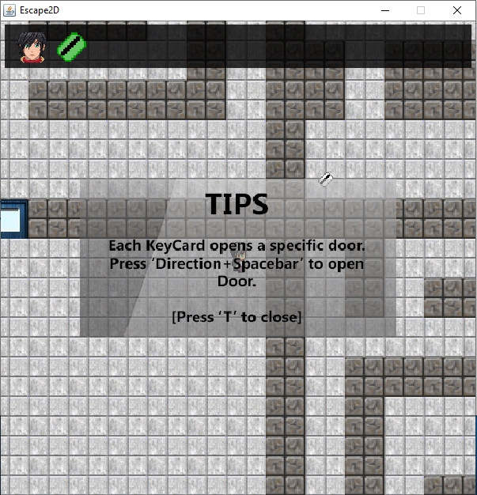
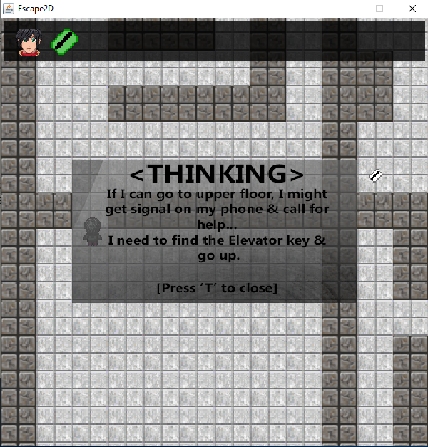
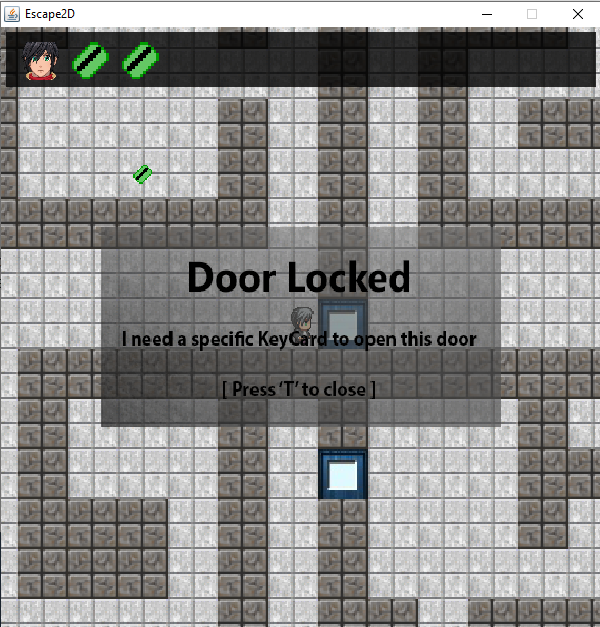

# Escape-2D

Pixel based java RPG game I programmed for Java project during 7th semester in University.
The game storyline is based on a person who somehow trapped himself in an abandoned house during zombie apocalypse. Now he has to move around the maze and find keycards to pass through different doors to find the exit.

### Screenshots of the UI

  

  

 

### How to Play

Clone or Download the project. Double click on the jar file to start the game.
Make sure you have java installed and properly configured.

### Controls

- Arrow keys to move around.
- Press 'Space' to perform action.
- Follow along the instruction as you play.

### Side Note
Unfortunately I was in a rush while working on this project and completed only one level during the semester. Later couldn't continue the project due to other tasks in hand. Maps are dynamic, stored in Resources/Maps folder. you just have to create a new .txt file following along the existing maps. If anyone is interested to continue this project, feel free to ask anything. I would be happy to help.
